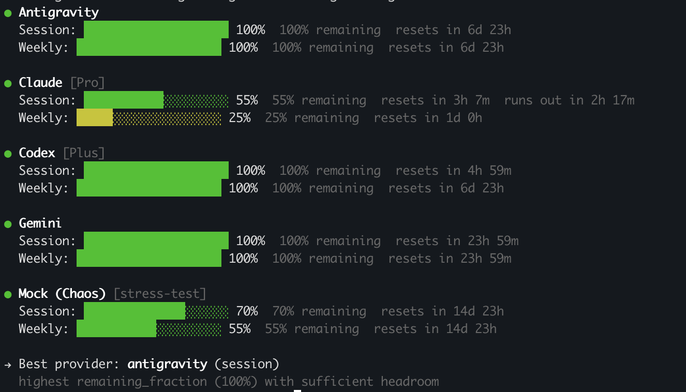

# agentusage — `au`

A fast, native CLI for monitoring AI provider usage across Anthropic, OpenAI, Google Gemini, Cursor, Codex, Copilot, and 10+ more — all from a single command.

Built for both humans and AI agents. Run `au status --json` as a skill inside Claude Code, Cursor, or any agent framework to make intelligent model-selection decisions based on remaining quota.



## Install

```sh
brew install ForgeRelayAI/tap/agentusage
```

Or build from source:

```sh
cargo build --release
```

## Usage

```sh
au status                        # human-readable usage summary
au status --json                 # machine-readable JSON (agent skill interface)
au status --provider claude      # filter to one provider
au status -v                     # verbose: include providers with errors
```

## As an AI agent skill

Add this to your `CLAUDE.md` (or equivalent) to let your agent pick the best available model:

```markdown
## Model selection
Before starting any task, run `au status --json` and check `recommendation.best_provider`.
- If the current provider is `sufficient`, proceed normally.
- If it is `low`, shrink scope or split the task into phases.
- If it is `exhausted`, route to another healthy provider or fall back to an API lane.
```

### JSON output schema

```json
{
  "schema_version": 1,
  "fetched_at": "2026-03-19T10:00:00Z",
  "providers": [
    {
      "id": "codex",
      "display_name": "Codex",
      "status": "ok",
      "session": {
        "remaining_fraction": 0.55,
        "resets_at": "2026-03-24T19:59:31.000Z"
      },
      "weekly": {
        "remaining_fraction": 0.93,
        "resets_at": "2026-03-30T10:43:45.000Z"
      },
      "recommendation": "sufficient"
    }
  ],
  "recommendation": {
    "best_provider": "codex",
    "best_provider_period": "weekly",
    "reason": "highest remaining_fraction (93%) with sufficient headroom"
  }
}
```

## Using `au` with OpenClaw

OpenClaw can use `au` as a quota signal before choosing how to run a task. A practical pattern is to wrap `au status --json` in a small helper such as `au-check` and route work at task boundaries instead of trying to hot-swap providers mid-step.

### 1. Pre-task routing

```bash
au-check route
# codex_oauth -> use the normal Codex OAuth lane
# codex_api   -> use an API-backed Codex fallback for this phase
```

### 2. Provider ranking for delegation

```bash
au status --json | jq -r '
  [.providers[] | select(.status == "ok" and .recommendation != "exhausted")]
  | sort_by(-(.session.remaining_fraction // .weekly.remaining_fraction // 0))
  | .[].id'
```

### 3. Avoiding partial work

```bash
au status --json | jq -r '
  .providers[] | select(.id == "codex") |
  {status, recommendation, session: .session.remaining_fraction, resets_at: .session.resets_at}'
```

If the provider is `low`, split the task into phases. If it is `exhausted`, route the current phase elsewhere.

### 4. Autonomous sessions

Re-check `au` after a checkpoint or before the next major execution phase. If the preferred provider is still exhausted, stay on the fallback lane. If it has recovered, switch back on the next phase.

### 5. User-facing transparency

```bash
au status --json | jq -r '
  .providers[]
  | select(.status == "ok")
  | "- \(.display_name): \((.session.remaining_fraction // .weekly.remaining_fraction) * 100 | round)% remaining [\(.recommendation | ascii_upcase)]"'
```

### 6. Quota-aware decomposition

Use `providers[].recommendation` as the planning signal:

- `sufficient` → proceed normally
- `low` → split into phases and keep the first phase small
- `exhausted` → switch lanes or defer until reset

Use `providers[].session.resets_at` or `providers[].weekly.resets_at` when you need to explain when quota will recover.

## Supported providers

| Provider | Plugin |
|----------|--------|
| Anthropic Claude | `claude` |
| OpenAI Codex | `codex` |
| Google Gemini | `gemini` |
| GitHub Copilot | `copilot` |
| Cursor | `cursor` |
| Windsurf | `windsurf` |
| Amp | `amp` |
| Antigravity | `antigravity` |
| Factory | `factory` |
| JetBrains AI | `jetbrains-ai-assistant` |
| Kimi | `kimi` |
| MiniMax | `minimax` |
| OpenCode Go | `opencode-go` |
| Perplexity | `perplexity` |
| ZAI | `zai` |

Providers are loaded from `~/Library/Application Support/agentusage/plugins/` (macOS) or the XDG equivalent on Linux. Drop any compatible [OpenUsage](https://github.com/robinebers/openusage) plugin directory there to add a new provider instantly — no recompile needed.

## Plugin system

AgentUsage is compatible with the [robinebers/openusage](https://github.com/robinebers/openusage) JS plugin format. Each plugin is a directory with three files:

```
plugins/<id>/
  plugin.json   ← manifest (id, name, lines schema)
  plugin.js     ← probe() function runs in a QuickJS sandbox
  icon.svg      ← brand icon
```

Plugins run inside `rquickjs` — the same sandboxed JS runtime used by the upstream project. The host API surface (`ctx.host.http`, `ctx.host.fs`, `ctx.host.sqlite`, `ctx.host.keychain`, etc.) is implemented in Rust.

Credentials are stored in the native OS keychain (macOS Keychain, Windows Credential Manager, libsecret on Linux) — never in plaintext.

## Building

Requires Rust 1.78+.

```sh
git clone https://github.com/benliong/agentusage-cli
cd agentusage-cli
cargo build --release
./target/release/au status
```

## Credits

Bundled plugins are sourced from [robinebers/openusage](https://github.com/robinebers/openusage) under their original license. See [bundled_plugins/NOTICE](bundled_plugins/NOTICE).
